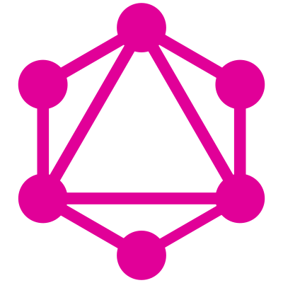

## GraphQL

GraphQL is a query language for APIs developed by Facebook to solve the problems
that their mobile and web development teams were facing with performance and
maintenance.

* GraphQL allows developers to query their APIs more efficiently by eliminating "under-fetching" and "over-fetching".
* GraphQL lets us work more efficiently by providing powerful development tools and automatic documentation.
* GraphQL allows mobile development teams to avoid the high maintenance cost of versioning APIs when evolving their API while still supporting older clients.

Learn more at [graphql.org](http://graphql.org/).
